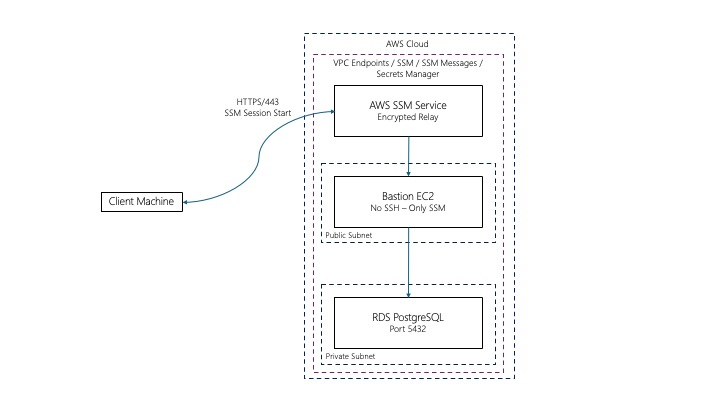

# RDS Database with AWS Systems Manager Session Manager
This solution uses the AWS Systems Manager
Session Manager (that does not need to have inbound traffic
ports) to connect to a database server in the AWS cloud.

A session is a connection to a node that uses a bi-directional channel between
the client and the AWS cloud.  Traffic is encrypted and signed.  The Session Manager plug-in
to the existing AWS CLI needs to be installed.

To start the process you need to run the following command:

`aws ssm start-session`

This opens up an encrypted websocket connection to the AWS Systems Manager (SSM) service
over port 443.  Since this is normal outbound internet traffic, no firewalls rules are generally
needed

The server (bastion) that is running doesn't have any inbound port or SSH
keys; it also sits on a public subnet.  The SSM Agent running on this node maintains a persistent outbound connection to the SSM
service.  When a session starts, SSM routes traffic through this connection.  The traffic is then passed
to the database server that sits on a private subnet network.



### Security Benefits

- No open inbound ports
- No SSH keys needed
- RDS is completely unreachable from the internet
- All traffic is encrypted in transit
- IAM controls who can connect
- Credentials are stored in Secrets Manager

### How To Connect

```text
aws secretsmanager get-secret-value \
  --secret-id arn:aws:secretsmanager:{your secrets ARN} \
  --region us-east-1 \
  --query SecretString \
  --output text | python3 -c "import sys,json; print(json.load(sys.stdin)['password'])"
```
This will print the password you will need for your database client. Then you will need to start the session using
the following command:

```text
aws ssm start-session \
  --target {instance_name} \
  --document-name AWS-StartPortForwardingSessionToRemoteHost \
  --parameters host="{full RDS host name}",portNumber="5432",localPortNumber="5432" \
  --region us-east-1
```
Then open your database client to connect to `127.0.0.1:5432`

## Example Data
### Create Data

```text
-- Clean slate
DROP TABLE IF EXISTS order_items CASCADE;
DROP TABLE IF EXISTS orders CASCADE;
DROP TABLE IF EXISTS products CASCADE;
DROP TABLE IF EXISTS categories CASCADE;
DROP TABLE IF EXISTS customers CASCADE;

-- Categories
CREATE TABLE categories (
    id          SERIAL PRIMARY KEY,
    name        VARCHAR(50) NOT NULL,
    description TEXT
);

-- Products
CREATE TABLE products (
    id          SERIAL PRIMARY KEY,
    category_id INT REFERENCES categories(id),
    name        VARCHAR(100) NOT NULL,
    price       NUMERIC(10,2) NOT NULL,
    stock       INT DEFAULT 0
);

-- Customers
CREATE TABLE customers (
    id         SERIAL PRIMARY KEY,
    name       VARCHAR(100) NOT NULL,
    email      VARCHAR(150) UNIQUE NOT NULL,
    city       VARCHAR(50),
    joined_at  DATE DEFAULT CURRENT_DATE
);

-- Orders
CREATE TABLE orders (
    id          SERIAL PRIMARY KEY,
    customer_id INT REFERENCES customers(id),
    status      VARCHAR(20) DEFAULT 'pending',
    created_at  TIMESTAMP DEFAULT NOW()
);

-- Order Items
CREATE TABLE order_items (
    id         SERIAL PRIMARY KEY,
    order_id   INT REFERENCES orders(id),
    product_id INT REFERENCES products(id),
    quantity   INT NOT NULL,
    unit_price NUMERIC(10,2) NOT NULL
);

-- Seed categories
INSERT INTO categories (name, description) VALUES
    ('Laptops',     'Portable computers'),
    ('Accessories', 'Cables, mice, keyboards'),
    ('Monitors',    'Desktop displays'),
    ('Storage',     'SSDs and hard drives'),
    ('Networking',  'Routers and switches');

-- Seed products
INSERT INTO products (category_id, name, price, stock) VALUES
    (1, 'MacBook Pro 14"',        1999.99,  25),
    (1, 'Dell XPS 15',            1499.99,  30),
    (1, 'Lenovo ThinkPad X1',     1299.99,  40),
    (2, 'Logitech MX Master 3',     99.99, 150),
    (2, 'Mechanical Keyboard',     129.99, 100),
    (2, 'USB-C Hub 7-in-1',         49.99, 200),
    (2, 'Webcam HD 1080p',          79.99,  80),
    (3, 'LG 27" 4K Monitor',       599.99,  35),
    (3, 'Dell 24" IPS',            349.99,  50),
    (3, 'Samsung 32" Curved',      449.99,  20),
    (4, 'Samsung 1TB SSD',         109.99, 120),
    (4, 'WD 2TB External HDD',      79.99,  90),
    (4, 'Kingston 512GB NVMe',      64.99, 110),
    (5, 'Netgear WiFi 6 Router',   199.99,  45),
    (5, 'TP-Link 8-Port Switch',    39.99,  75);

-- Seed customers
INSERT INTO customers (name, email, city, joined_at) VALUES
    ('Alice Johnson',  'alice@example.com',   'New York',    '2022-01-15'),
    ('Bob Smith',      'bob@example.com',     'Los Angeles', '2022-03-22'),
    ('Carol White',    'carol@example.com',   'Chicago',     '2022-05-10'),
    ('David Brown',    'david@example.com',   'Houston',     '2022-07-04'),
    ('Eva Martinez',   'eva@example.com',     'Phoenix',     '2022-09-18'),
    ('Frank Lee',      'frank@example.com',   'New York',    '2023-01-05'),
    ('Grace Kim',      'grace@example.com',   'Chicago',     '2023-02-14'),
    ('Henry Wilson',   'henry@example.com',   'Los Angeles', '2023-04-20'),
    ('Iris Chen',      'iris@example.com',    'New York',    '2023-06-30'),
    ('Jack Davis',     'jack@example.com',    'Houston',     '2023-08-11'),
    ('Karen Taylor',   'karen@example.com',   'Phoenix',     '2023-10-25'),
    ('Liam Anderson',  'liam@example.com',    'Chicago',     '2024-01-08'),
    ('Mia Thomas',     'mia@example.com',     'New York',    '2024-02-19'),
    ('Noah Jackson',   'noah@example.com',    'Los Angeles', '2024-03-05'),
    ('Olivia Harris',  'olivia@example.com',  'Houston',     '2024-04-12');

-- Seed orders
INSERT INTO orders (customer_id, status, created_at) VALUES
    (1,  'completed', '2024-01-05 10:23:00'),
    (1,  'completed', '2024-03-12 14:05:00'),
    (2,  'completed', '2024-01-18 09:15:00'),
    (3,  'completed', '2024-02-02 16:40:00'),
    (3,  'shipped',   '2024-04-22 11:30:00'),
    (4,  'completed', '2024-02-14 13:55:00'),
    (5,  'completed', '2024-03-01 08:20:00'),
    (5,  'pending',   '2024-04-30 17:45:00'),
    (6,  'completed', '2024-01-25 12:10:00'),
    (7,  'completed', '2024-02-08 15:35:00'),
    (8,  'shipped',   '2024-04-15 10:50:00'),
    (9,  'completed', '2024-03-20 14:25:00'),
    (10, 'completed', '2024-02-28 09:40:00'),
    (11, 'pending',   '2024-04-28 16:15:00'),
    (12, 'completed', '2024-03-10 11:05:00'),
    (13, 'completed', '2024-04-02 13:20:00'),
    (14, 'shipped',   '2024-04-18 10:35:00'),
    (15, 'completed', '2024-03-25 15:50:00'),
    (1,  'pending',   '2024-04-29 09:00:00'),
    (2,  'completed', '2024-04-10 14:30:00');

-- Seed order items
INSERT INTO order_items (order_id, product_id, quantity, unit_price) VALUES
    (1,  1,  1, 1999.99),
    (1,  4,  1,   99.99),
    (2,  8,  1,  599.99),
    (2,  5,  1,  129.99),
    (3,  2,  1, 1499.99),
    (3,  6,  2,   49.99),
    (4,  9,  2,  349.99),
    (4,  7,  1,   79.99),
    (5,  11, 1,  109.99),
    (5,  12, 1,   79.99),
    (6,  3,  1, 1299.99),
    (6,  4,  1,   99.99),
    (7,  10, 1,  449.99),
    (7,  13, 2,   64.99),
    (8,  14, 1,  199.99),
    (9,  1,  1, 1999.99),
    (9,  5,  1,  129.99),
    (10, 8,  1,  599.99),
    (10, 6,  1,   49.99),
    (11, 2,  1, 1499.99),
    (11, 7,  1,   79.99),
    (12, 15, 2,   39.99),
    (12, 13, 1,   64.99),
    (13, 3,  1, 1299.99),
    (13, 11, 2,  109.99),
    (14, 9,  1,  349.99),
    (14, 4,  2,   99.99),
    (15, 10, 1,  449.99),
    (15, 12, 1,   79.99),
    (16, 1,  1, 1999.99),
    (16, 6,  3,   49.99),
    (17, 8,  1,  599.99),
    (17, 5,  1,  129.99),
    (18, 14, 1,  199.99),
    (18, 13, 1,   64.99),
    (19, 2,  1, 1499.99),
    (20, 9,  1,  349.99),
    (20, 7,  2,   79.99);
```

Verify that the data loaded:

```text
SELECT 'categories' AS table_name, COUNT(*) FROM categories
UNION ALL
SELECT 'products',   COUNT(*) FROM products
UNION ALL
SELECT 'customers',  COUNT(*) FROM customers
UNION ALL
SELECT 'orders',     COUNT(*) FROM orders
UNION ALL
SELECT 'order_items',COUNT(*) FROM order_items;
```
There should be the following:

- categories 5 entries
- products 15 entries
- customers 15 entries
- orders 20 entries
- order_items 38

## What is a CTE
A Common Table Expression (CTE) is a temporary named result set that you define at the top of a query 
using the `WITH` keyword. This feels like the C++ `inline` command where you can define a function prefixed with 
`inline` and where the function used it the compiler will add the code.  I think that the difference here is that
the result is either pre-compiled or that the query is in such a state that it becomes an efficient construct within 
another query.

This is an example query I found:

```sql
SELECT customer_id, SUM(quantity * unit_price) AS total
FROM orders o
JOIN order_items oi ON o.id = oi.order_id
WHERE status = 'completed'
GROUP BY customer_id
HAVING SUM(quantity * unit_price) > 500;
```

I can create a CTE like the following:

```sql
WITH completed_order_totals AS (
    SELECT customer_id, SUM(quantity * unit_price) AS total
    FROM orders o
    JOIN order_items oi ON o.id = oi.order_id
    WHERE status = 'completed'
    GROUP BY customer_id
)
SELECT *
FROM completed_order_totals
WHERE total > 500;
```

One thing to note that I have observed is that you cannot create the `WITH` statement on its own.  You
need to have a followup query.

Basic query - get all the customers from New York:

```sql
WITH new_york_customers AS (
    SELECT id, name, email
    FROM customers
    WHERE city = 'New York'
)
SELECT *
FROM new_york_customers;
```

Filtering on a CTE

```sql
WITH customer_spending AS (
    SELECT
        c.id,
        c.name,
        c.city,
        SUM(oi.quantity * oi.unit_price) AS total_spent
    FROM customers c
    JOIN orders o      ON c.id = o.customer_id
    JOIN order_items oi ON o.id = oi.order_id
    GROUP BY c.id, c.name, c.city
)
SELECT *
FROM customer_spending
WHERE total_spent > 1000
ORDER BY total_spent DESC;
```

Chained CTEs are where we have CTEs built on top of each other like the following:

```sql
WITH order_totals AS (
    -- Step 1: total value of each order
    SELECT
        o.id         AS order_id,
        o.customer_id,
        o.status,
        SUM(oi.quantity * oi.unit_price) AS order_value
    FROM orders o
    JOIN order_items oi ON o.id = oi.order_id
    GROUP BY o.id, o.customer_id, o.status
),
customer_totals AS (
    -- Step 2: roll up to customer level (reference first CTE)
    SELECT
        customer_id,
        COUNT(order_id)    AS num_orders,
        SUM(order_value)   AS lifetime_value,
        MAX(order_value)   AS biggest_order
    FROM order_totals
    WHERE status = 'completed'
    GROUP BY customer_id
),
ranked_customers AS (
    -- Step 3: join back to customers and rank them
    SELECT
        c.name,
        c.city,
        ct.num_orders,
        ct.lifetime_value,
        ct.biggest_order,
        RANK() OVER (ORDER BY ct.lifetime_value DESC) AS spending_rank
    FROM customers c
    JOIN customer_totals ct ON c.id = ct.customer_id
)
-- Final query: only show top 5
SELECT *
FROM ranked_customers
WHERE spending_rank <= 5;
```

Customers who have never placed an order:

```sql
WITH customers_with_orders AS (
    SELECT distinct(customer_id) FROM
    ORDERS
)
SELECT id, name FROM
CUSTOMER where id NOT IN customers_with_orders;
```